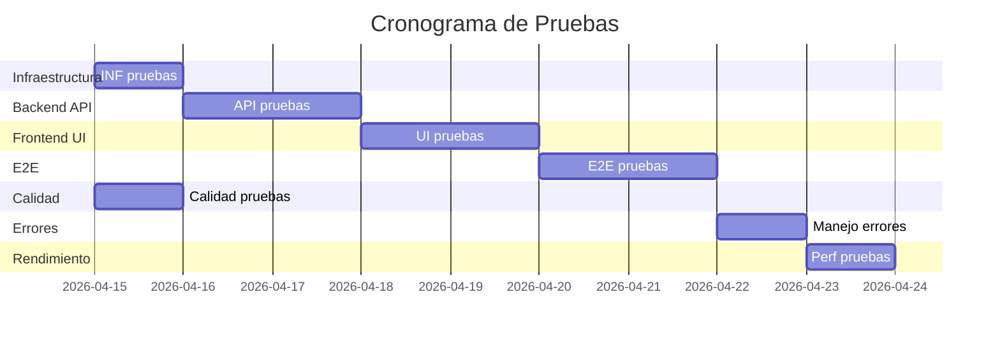

# 📋 **PLAN DE PRUEBAS - TEACHER TOOL**

**Versión:** 1.0  
**Fecha de creación:** 14 de abril de 2026  
**Rama:** main (v0.13.0)  
**Última ejecución:** Pendiente  
**Responsable QA:** Por asignar

---

## 📊 **RESUMEN DE ESTADO**

| Categoría | Total | ✅ Pasadas | ❌ Fallidas | ⚠️ Omitidas | % Completado |
|-----------|-------|------------|-------------|-------------|--------------|
| **Infraestructura** | 8 | 0 | 0 | 8 | 0% |
| **Backend (API)** | 25 | 0 | 0 | 25 | 0% |
| **Frontend (UI)** | 17 | 0 | 0 | 17 | 0% |
| **Integración (E2E)** | 8 | 0 | 0 | 8 | 0% |
| **Calidad contenido** | 11 | 6 | 0 | 5 | 55% |
| **Manejo errores** | 7 | 0 | 0 | 7 | 0% |
| **Rendimiento** | 4 | 0 | 0 | 4 | 0% |
| **TOTAL** | **80** | **6** | **0** | **74** | **8%** |

---

## 🎯 **EJECUCIÓN PRÓXIMA**

### Fecha programada: **15 de abril de 2026**
### Entorno: **Localhost (development)**
### Recursos requeridos:
- ✅ API key de OpenRouter
- ✅ LibreOffice instalado
- ✅ Node.js 18+, Python 3.12+
- ✅ 2GB RAM mínimo

---

## 1. **PRUEBAS DE INFRAESTRUCTURA** ⚙️

### Estado: ⚠️ **Pendiente de ejecución**

| ID | Prueba | Descripción | Estado | Fecha | Observaciones |
|----|--------|-------------|--------|-------|---------------|
| INF-01 | Backend health | GET /api/health | ⚠️ | - | - |
| INF-02 | Frontend accesible | GET http://localhost:5173 | ⚠️ | - | - |
| INF-03 | Base de datos SQLite | Verificar archivo y tablas | ⚠️ | - | - |
| INF-04 | Directorio storage | Verificar existencia | ⚠️ | - | - |
| INF-05 | Node.js | Versión >= 18.x | ⚠️ | - | - |
| INF-06 | Python | Versión >= 3.12 | ⚠️ | - | - |
| INF-07 | LibreOffice | Binary existe | ⚠️ | - | - |
| INF-08 | npm packages | Dependencias instaladas | ⚠️ | - | - |

**Preparación:** Script de inicialización de entorno

---

## 2. **PRUEBAS DE BACKEND (API)** 🔧

### Estado: ⚠️ **Pendiente de ejecución**

| ID | Prueba | Descripción | Estado | Fecha | Observaciones |
|----|--------|-------------|--------|-------|---------------|
| API-01 | Upload PDF válido | Procesa PDF de prueba | ⚠️ | - | - |
| API-02 | Upload DOCX válido | Procesa DOCX de prueba | ⚠️ | - | - |
| API-03 | Upload DOC válido | Convierte DOC a DOCX | ⚠️ | - | - |
| API-04 | Upload archivo grande | PDF de 5MB | ⚠️ | - | - |
| API-05 | Upload tipo inválido | Archivo .exe | ⚠️ | - | - |
| API-06 | Upload sin archivo | POST sin body | ⚠️ | - | - |
| API-07 | Generate guía básica | material_type: guia | ⚠️ | - | - |
| API-08 | Generate ejercicios | material_type: ejercicios | ⚠️ | - | - |
| API-09 | Generate examen_seleccion | 10 preguntas | ⚠️ | - | - |
| API-10 | Generate num_preguntas bajo | 3 (fuera de rango) | ⚠️ | - | - |
| API-11 | Generate num_preguntas alto | 100 (fuera de rango) | ⚠️ | - | - |
| API-12 | Generate contenido corto | < 500 caracteres | ⚠️ | - | - |
| API-13 | Generate streaming | SSE chunks progresivos | ⚠️ | - | - |
| API-14 | Generate modelo DeepSeek | deepseek/deepseek-v3.2 | ⚠️ | - | - |
| API-15 | Generate modelo MiniMax | minimax/minimax-01 | ⚠️ | - | - |
| API-16 | Generate sin API key | API key inválida | ⚠️ | - | - |
| API-17 | Generate tipo inválido | material_type inválido | ⚠️ | - | - |
| API-18 | Listar sesiones | GET /api/sessions | ⚠️ | - | - |
| API-19 | Obtener sesión por ID | GET /api/sessions/:id | ⚠️ | - | - |
| API-20 | Eliminar sesión | DELETE /api/sessions/:id | ⚠️ | - | - |
| API-21 | Sesión no existe | GET /api/sessions/invalid-id | ⚠️ | - | - |
| API-22 | Obtener settings | GET /api/settings | ⚠️ | - | - |
| API-23 | Actualizar school_name | PUT /api/settings | ⚠️ | - | - |
| API-24 | Actualizar teacher_name | PUT /api/settings | ⚠️ | - | - |
| API-25 | Persistencia settings | Reinicio backend | ⚠️ | - | - |

**Preparación:** Archivos de prueba en `/test-files/`

---

## 3. **PRUEBAS DE FRONTEND (UI)** 🎨

### Estado: ⚠️ **Pendiente de ejecución**

| ID | Prueba | Descripción | Estado | Fecha | Observaciones |
|----|--------|-------------|--------|-------|---------------|
| UI-01 | DropZone visible | Página inicial | ⚠️ | - | - |
| UI-02 | Drag and drop archivo | Arrastrar PDF | ⚠️ | - | - |
| UI-03 | Click para subir | File dialog | ⚠️ | - | - |
| UI-04 | Feedback subir archivo | Spinner visible | ⚠️ | - | - |
| UI-05 | Error archivo inválido | Archivo .exe | ⚠️ | - | - |
| UI-06 | MaterialSelector visible | 7 opciones | ⚠️ | - | - |
| UI-07 | Opción Guía | Click Guía de Estudio | ⚠️ | - | - |
| UI-08 | Opción Ejercicios | Click Ejercicios | ⚠️ | - | - |
| UI-09 | Opción Examen Selección | Click Examen | ⚠️ | - | - |
| UI-10 | Campo numPreguntas | Input numérico (5-50) | ⚠️ | - | - |
| UI-11 | Validación numPreguntas bajo | 3 (error) | ⚠️ | - | - |
| UI-12 | Validación numPreguntas alto | 100 (error) | ⚠️ | - | - |
| UI-13 | Validación numPreguntas válido | 20 (ok) | ⚠️ | - | - |
| UI-14 | Textarea visible | Instrucciones adicionales | ⚠️ | - | - |
| UI-15 | Límite caracteres | > 500 caracteres | ⚠️ | - | - |
| UI-16 | Placeholder visible | Text vacío | ⚠️ | - | - |
| UI-17 | Botón Generar habilitado | Condiciones cumplidas | ⚠️ | - | - |
| UI-18 | Click Generar | Inicia generación | ⚠️ | - | - |
| UI-19 | Streaming visible | Contenido progresivo | ⚠️ | - | - |
| UI-20 | Mensajes de progreso | Estados de generación | ⚠️ | - | - |
| UI-21 | Cancelar generación | Botón cancelar | ⚠️ | - | - |
| UI-22 | Generación completada | Resultado final | ⚠️ | - | - |
| UI-23 | Sidebar visible | Historial de sesiones | ⚠️ | - | - |
| UI-24 | Click sesión | Cargar contenido | ⚠️ | - | - |
| UI-25 | Eliminar sesión | Botón eliminar | ⚠️ | - | - |
| UI-26 | Dropdown modelos | Header superior | ⚠️ | - | - |
| UI-27 | Cambiar a DeepSeek | Selección modelo | ⚠️ | - | - |
| UI-28 | Cambiar a MiniMax | Selección modelo | ⚠️ | - | - |

**Preparación:** Interfaz web debe estar corriendo

---

## 4. **PRUEBAS DE INTEGRACIÓN (E2E)** 🔗

### Estado: ⚠️ **Pendiente de ejecución**

| ID | Prueba | Descripción | Estado | Fecha | Observaciones |
|----|--------|-------------|--------|-------|---------------|
| E2E-01 | Upload → Generar → Descargar | Guía de Estudio completa | ⚠️ | - | - |
| E2E-02 | Examen 10 preguntas | PDF → Selección examen → Generar | ⚠️ | - | - |
| E2E-03 | Examen 20 preguntas | Diferente cantidad | ⚠️ | - | - |
| E2E-04 | Upload DOCX → 15 preguntas | Diferente formato input | ⚠️ | - | - |
| E2E-05 | Ejercicios | Evaluación completa | ⚠️ | - | - |
| E2E-06 | Plan de Clase | Plan estructurado | ⚠️ | - | - |
| E2E-07 | Mapa Conceptual | Jerarquía visual | ⚠️ | - | - |
| E2E-08 | Glosario | Definiciones incluidas | ⚠️ | - | - |

**Preparación:** Flujos completos automatizados

---

## 5. **PRUEBAS DE CALIDAD DE CONTENIDO** 📄

### Estado: 🟡 **Parcialmente ejecutado (6/11)**

| ID | Prueba | Descripción | Estado | Fecha | Observaciones |
|----|--------|-------------|--------|-------|---------------|
| QUAL-01 | Formato preguntas | "Pregunta N:" en output | ✅ | 14/04/2026 | Validado |
| QUAL-02 | 3 opciones por pregunta | a), b), c) presentes | ✅ | 14/04/2026 | Validado |
| QUAL-03 | Una respuesta correcta | Solo una correcta | ✅ | 14/04/2026 | Validado |
| QUAL-04 | Opciones plausibles | No absurdas | ⚠️ | - | - |
| QUAL-05 | Hoja de respuestas | "CLAVE DE RESPUESTAS" | ✅ | 14/04/2026 | Validado |
| QUAL-06 | Checkboxes □ | Versión estudiante | ✅ | 14/04/2026 | Validado |
| QUAL-07 | Nivel secundaria | Lenguaje apropiado | ✅ | 14/04/2026 | Validado |
| QUAL-08 | Preguntas de aplicación | 2-3 preguntas prácticas | ⚠️ | - | - |
| QUAL-09 | Guía - Estructura | Formatos correctos | ⚠️ | - | - |
| QUAL-10 | Ejercicios - tipos | Todos tipos presentes | ⚠️ | - | - |
| QUAL-11 | Plan de Clase - momentos | Estructura completa | ⚠️ | - | - |

**Observaciones:** 6/11 pruebas ejecutadas en `test-phase13.sh`

---

## 6. **PRUEBAS DE MANEJO DE ERRORES** ❌

### Estado: ⚠️ **Pendiente de ejecución**

| ID | Prueba | Descripción | Estado | Fecha | Observaciones |
|----|--------|-------------|--------|-------|---------------|
| ERR-01 | PDF escaneado sin texto | Solo imágenes | ⚠️ | - | - |
| ERR-02 | PDF corrupto | Archivo corrupto | ⚠️ | - | - |
| ERR-03 | Archivo muy grande | > 10MB | ⚠️ | - | - |
| ERR-04 | Documento vacío | 0 bytes | ⚠️ | - | - |
| ERR-05 | API key inválida | Key incorrecta | ⚠️ | - | - |
| ERR-06 | Rate limit | Muchas solicitudes | ⚠️ | - | - |
| ERR-07 | Backend caído | Conexión falla | ⚠️ | - | - |

**Preparación:** Archivos de prueba problemáticos

---

## 7. **PRUEBAS DE RENDIMIENTO** ⚡

### Estado: ⚠️ **Pendiente de ejecución**

| ID | Prueba | Descripción | Estado | Fecha | Observaciones |
|----|--------|-------------|--------|-------|---------------|
| PERF-01 | Tiempo upload PDF | PDF de 1MB | ⚠️ | - | - |
| PERF-02 | Tiempo generación | Guía 1000 palabras | ⚠️ | - | - |
| PERF-03 | Tiempo DOCX | Generación completa | ⚠️ | - | - |
| PERF-04 | Memoria | Durante generación | ⚠️ | - | - |

**Preparación:** Herramientas de medición (time, memory)

---

## 📝 **REGISTRO DE EJECUCIONES**

### Ejecución #1 (14/04/2026)
- **Responsable:** QA (automatizado)
- **Ámbito:** Calidad de contenido (parcial)
- **Resultados:** 6/11 pasadas, 0 fallidas, 5 omitidas
- **Observaciones:** Script `test-phase13.sh` ejecutado parcialmente (sin backend)
- **Issues identificados:** Ninguno

---

## 📋 **CHECKLIST DE PREPARACIÓN**

### Pre-ejecución
- [ ] Verificar API key de OpenRouter
- [ ] Iniciar servicios: `./scripts/run.sh`
- [ ] Crear directorio `test-files/` con archivos de prueba
- [ ] Configurar variables de entorno
- [ ] Verificar acceso a internet (para modelos IA)

### Post-ejecución
- [ ] Recopilar logs de backend
- [ ] Recopilar logs de frontend
- [ ] Guardar archivos generados en pruebas
- [ ] Documentar findings en este documento

---

## 🚨 **ISSUES IDENTIFICADOS**

| ID | Descripción | Categoría | Severidad | Estado | Asignado | Fecha |
|----|-------------|-----------|-----------|--------|----------|-------|
| **No hay issues reportados** | | | | | | |

---

## 🔧 **HERAMIENTAS REQUERIDAS**

1. **Script de testing:** `test-system.sh` (por implementar)
2. **Herramientas de medición:**
   - `time` (tiempos de ejecución)
   - `curl` (tests de API)
   - `puppeteer`/`cypress` (tests UI - opcional)
3. **Monitoreo:**
   - Logs de backend (`logs/backend.log`)
   - Logs de frontend (consola del browser)
4. **Entorno:** Docker container para consistencia

---

## 📈 **ESTADÍSTICAS DE PROGRESO**

---

## 📋 **PLANTILLA DE REPORTE**

### Ejecución #___
**Fecha:** DD/MM/YYYY  
**Responsable:** Nombre QA  
**Duración:** HH:MM  
**Entorno:** Localhost/Staging/Production  

**Resultados:**
- ✅ Pasadas: XX
- ❌ Fallidas: XX
- ⚠️ Omitidas: XX

**Issues críticos:**
1. [Descripción breve] - ID de prueba: XXX

**Observaciones:**
- [Notas relevantes]

**Acciones correctivas:**
- [ ] Asignar issue a programador
- [ ] Programar re-ejecución
- [ ] Actualizar documentación

**Firma:** ___________________

---

## 🎯 **PRÓXIMAS ACCIONES**

| Acción | Responsable | Fecha límite | Estado |
|--------|------------|--------------|--------|
| Implementar `test-system.sh` | Programador | 15/04/2026 | ⚠️ Pendiente |
| Ejecutar pruebas de infraestructura | QA | 15/04/2026 | ⚠️ Pendiente |
| Ejecutar pruebas de API | QA | 16/04/2026 | ⚠️ Pendiente |
| Ejecutar pruebas de UI | QA | 18/04/2026 | ⚠️ Pendiente |
| Ejecutar pruebas E2E | QA | 20/04/2026 | ⚠️ Pendiente |
| Ejecutar pruebas de errores | QA | 22/04/2026 | ⚠️ Pendiente |
| Ejecutar pruebas de rendimiento | QA | 23/04/2026 | ⚠️ Pendiente |

---

## 🔗 **DOCUMENTACIÓN RELACIONADA**

1. [Especificación de pruebas](./test-plan-specification.md) - Lista completa de 80 pruebas
2. [Phase 13 - Examen de Selección Única](../PLAN.md#fase-13--examen-de-selección-única-nueva-funcionalidad)
3. [Script de testing existente](../test-phase13.sh) - Calidad de contenido
4. [README del proyecto](../README.md) - Configuración y uso

---

## 📱 **CONTACTOS**

| Rol | Nombre | Correo | Teléfono |
|-----|--------|--------|----------|
| **Project Manager** | Por asignar | - | - |
| **Lead Developer** | Por asignar | - | - |
| **QA Lead** | Por asignar | - | - |
| **DevOps** | Por asignar | - | - |

---

**Documento mantenido por:** Equipo de QA  
**Última actualización:** 14 de abril de 2026  
**Próxima revisión:** 15 de abril de 2026